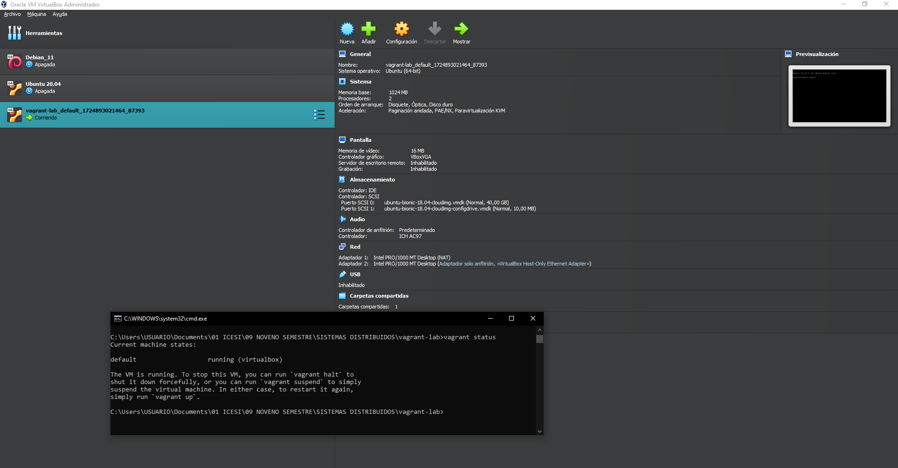
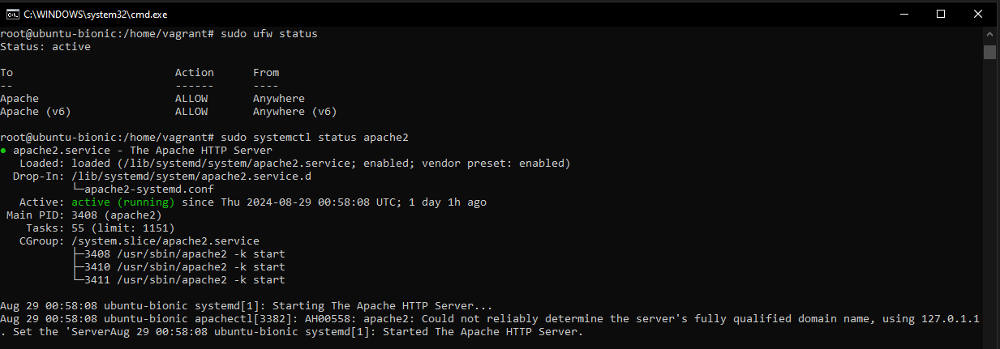
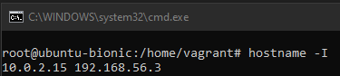
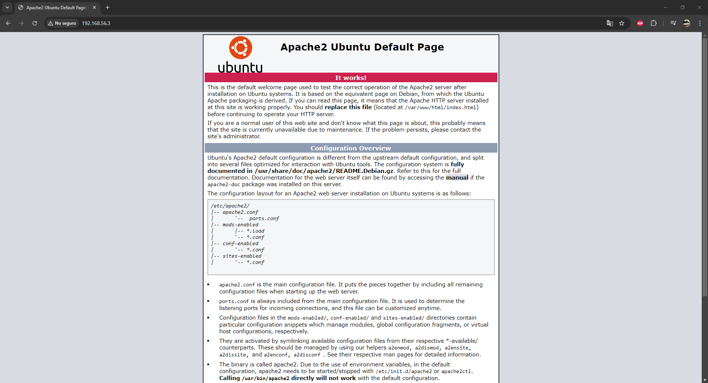

## Proyecto de Vagrant con Ubuntu y Apache

Este README detalla los pasos necesarios para configurar un entorno de desarrollo utilizando Vagrant con una máquina virtual Ubuntu 18.04 LTS (bionic64). Se cubren desde la inicialización del entorno hasta la instalación de Apache y la configuración del firewall.

### Requisitos Previos
* Vagrant instalado en tu sistema.

* VirtualBox instalado como proveedor de la máquina virtual.

### Pasos para la Configuración
#### 1. Inicializar el Proyecto Vagrant:

En primer lugar, se inicializa un nuevo proyecto de Vagrant con el siguiente comando:

`vagrant init`

Este comando generará un archivo Vagrantfile en el directorio actual. A continuación, modificaremos este archivo para configurar nuestra máquina virtual.

#### 2. Crear y Configurar el Vagrantfile
El archivo Vagrantfile debe configurarse para utilizar una caja de Ubuntu 18.04, configurar una red privada, instalar Apache y sincronizar una carpeta del host con la máquina virtual. El contenido del archivo Vagrantfile es el siguiente:

```
Vagrant.configure("2") do |config|
  # Usar una box de Ubuntu 18.04
  config.vm.box = "ubuntu/bionic64"

  # Configurar la red para acceder al servidor web
  config.vm.network "private_network", type: "dhcp"

  # Provisión para instalar Apache
  config.vm.provision "shell", inline: <<-SHELL
    apt-get update
    apt-get install -y apache2
  SHELL

  # Configurar la carpeta sincronizada
  config.vm.synced_folder ".", "/var/www/html"

  # Configurar la máquina virtual
  config.vm.provider "virtualbox" do |vb|
    vb.memory = "1024"
  end
end

```

### 3. Levantar la Máquina Virtual
Con el archivo Vagrantfile configurado, se levanta la máquina virtual con el siguiente comando:

`vagrant up`

Este comando comenzará a descargar la caja ubuntu/bionic64, creará y configurará la máquina virtual en VirtualBox, e instalará Apache.




### 4. Acceder a la Máquina Virtual
Para acceder a la máquina virtual, se utilizó  el siguiente comando:

`vagrant ssh`

### 5. Actualizar e Instalar Apache
Una vez dentro de la máquina virtual, se actualiza los paquetes y se instala el servidor Apache con los siguientes comandos:

```
sudo apt update
sudo apt install apache2
```

### 6. Configurar el Firewall con UFW
Se Activó el firewall UFW para aplicar las reglas necesarias:

`sudo ufw enable`

Y se permite el tráfico proveniente de Apache:

`sudo ufw allow "Apache"`


## 7. Verificar que Apache está Corriendo
Posteriormente, para verificar de que Apache está corriendo correctamente, se utilizó el siguiente comando:

`sudo systemctl status apache2`



### 8. Obtener la Dirección IP de la Máquina Virtual

Se buscó la dirección IP de la máquina virtual para acceder al servidor web desde el navegador. Para ello, se aplicó el siguiente comando:

`hostname -I`



Finalmente, en el navegador se accedió a la dirección IP obtenida y se visualizó la interfaz de apache2:




